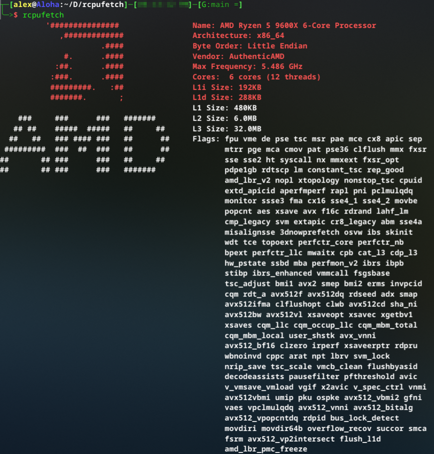

# rcpufetch

**rcpufetch** is a fast, cross-platform command-line tool written in Rust that displays detailed information about your CPU in a visually appealing way, including vendor ASCII art logos.

> [!WARNING]
> This project is still in early development, please report bugs under the issues tab. Check back in the future for the first release, thanks!

## Features
- Shows CPU model, vendor, core and thread count, cache sizes, maximum frequency, and CPU flags
- Displays a colorful ASCII art logo for your CPU vendor (AMD, Intel, ARM, NVIDIA, PowerPC, Apple)
- Override logo display with the `--logo` flag to show any vendor's logo regardless of your actual CPU
- Disable logo display entirely with the `--no-logo` flag for clean text output
- CPU feature flags detection on Linux (x86/ARM) and macOS (Apple Silicon)
- Clean codebase - nothing but Rust in here!
- Horizontally aligned output for easy reading, complete with logo support

## Screenshot



## 1. Current Support

| OS          | x86_64 / x86       | ARM                | RISC-V             | PowerPC            |
|:-----------:|:------------------:|:------------------:|:------------------:|:------------------:|
| GNU / Linux | ✅                 | ❓                 | ❓                 | ❓                |
| Windows     | ❌                 | ❌                 | -                  | -                  |
| MacOS       | :question:         | ✅                 | -                  | ❓                 |
| FreeBSD     | ❌                 | ❌                 | ❌                 | ❌                |


> [!WARNING]
> Linux & MacOS should be universal now, I haven't tested it or added more logos beyond x86_64 for Linux and arm64 for MacOS - TBD.

## Installation
1. Clone the repository:
   ```
   git clone https://github.com/yourusername/rcpufetch.git
   cd rcpufetch
   ```
2. Build with Cargo:
   ```
   cargo build --release
   ```
3. Run:
   ```
   ./target/release/rcpufetch
   ```

## Usage

### Basic Usage
```
rcpufetch
```
Displays CPU information with your actual vendor's logo.

### Command Line Options

#### Logo Override
```
rcpufetch --logo nvidia
rcpufetch -l intel
```
Display CPU information with a specific vendor's logo, regardless of your actual CPU vendor.

**Available logo options:**
- `nvidia` - NVIDIA logo (green/white theme)
- `amd` - AMD logo (red/white theme) 
- `intel` - Intel logo (cyan theme)
- `arm` - ARM logo (cyan theme)
- `powerpc` - PowerPC logo (yellow theme)
- `apple` - Apple logo (rainbow theme)

The logo option is case-insensitive, so `--logo NVIDIA`, `--logo nvidia`, and `--logo Nvidia` all work.

#### Disable Logo
```
rcpufetch --no-logo
rcpufetch -n
```
Display CPU information without any logo for clean text output.

### Examples

Show your CPU info with the default logo:
```
rcpufetch
```

Show your AMD CPU info with NVIDIA's logo:
```
rcpufetch --logo nvidia
```

Show CPU info without any logo:
```
rcpufetch --no-logo
```

## Contributing
See [CONTRIBUTING.md](CONTRIBUTING.md) for details on how to add features, support new operating systems, and contribute code or ASCII art.

## License
GPLv3
